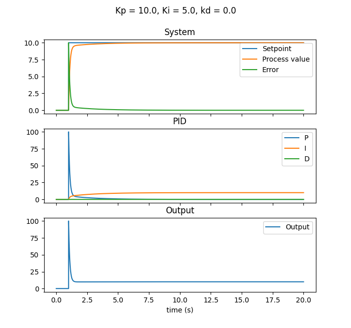
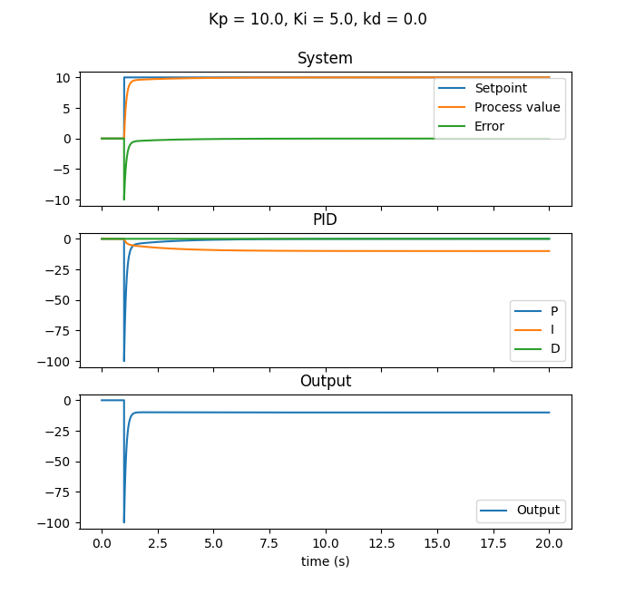
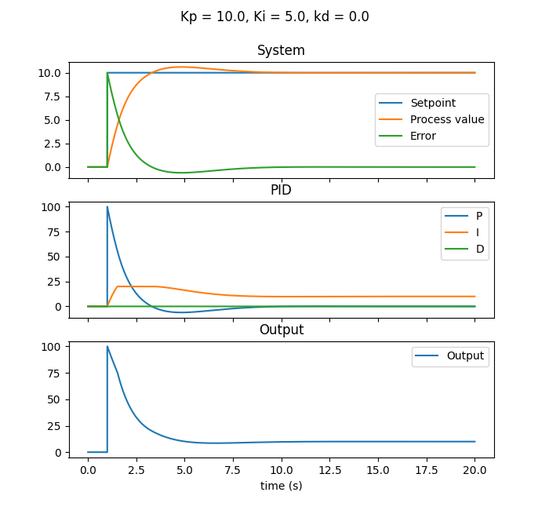
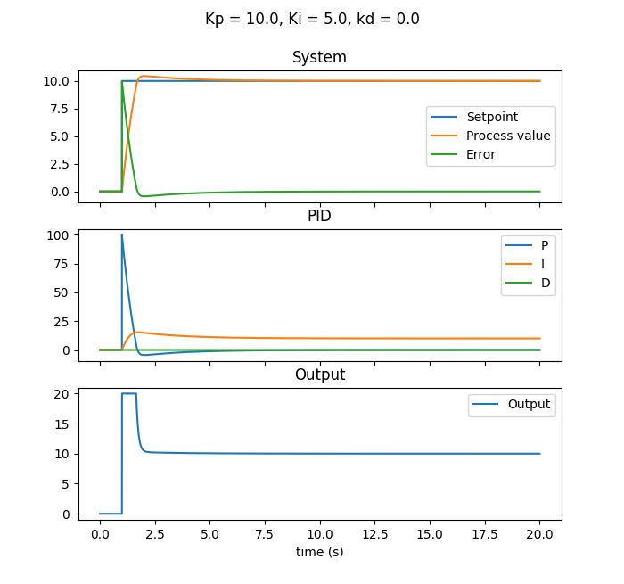
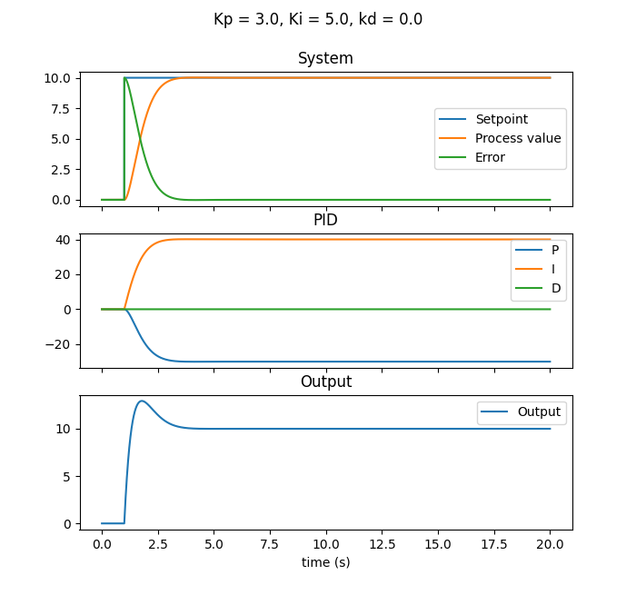
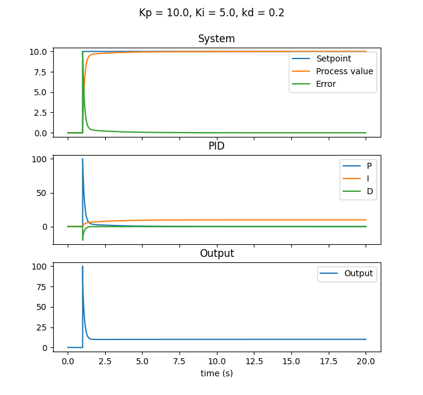
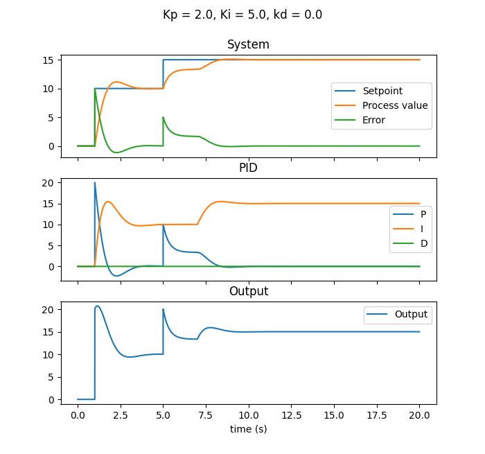
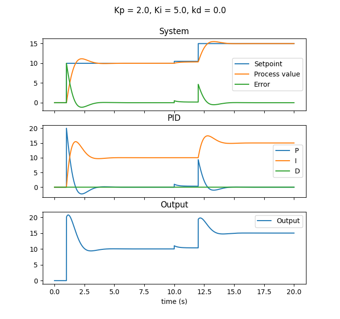
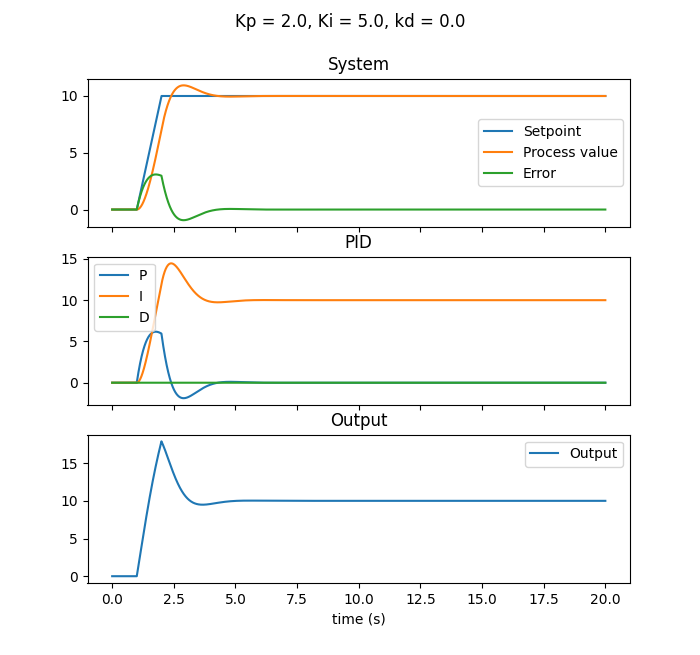

[](https://github.com/ThunderTecke/PID_Py/blob/develop/LICENSE)
[](https://github.com/ThunderTecke/PID_Py/releases)
[](https://github.com/ThunderTecke/PID_Py/releases)
[](https://github.com/ThunderTecke/PID_Py/commits)
[](https://github.com/ThunderTecke/PID_Py/issues)


# PID_Py <!-- omit in toc -->
`PID_Py` provide a PID controller written in Python. This PID controller is simple to use, but it's complete.

## :bangbang: Non-responsability :bangbang: <!-- omit in toc -->
***<span style="color:red">I am not responsible for any material or personal damages in case of failure. Use at your own risk.</span>***

## Table of content  <!-- omit in toc -->
- [Installation](#installation)
- [Usage](#usage)
  - [Minimum usage](#minimum-usage)
  - [Indirect action PID](#indirect-action-pid)
  - [Integral limitation](#integral-limitation)
  - [Limiting output](#limiting-output)
  - [Proportionnal on measurement](#proportionnal-on-measurement)
  - [Derivative on measurement](#derivative-on-measurement)
  - [Integral freezing](#integral-freezing)
  - [Deadband](#deadband)
  - [Setpoint ramp](#setpoint-ramp)
  - [Setpoint reached by the process value](#setpoint-reached-by-the-process-value)
  - [Process value stabilized indicator](#process-value-stabilized-indicator)
  - [Historian](#historian)
    - [Historian parameters list](#historian-parameters-list)
  - [Manual mode](#manual-mode)
  - [Logging](#logging)
  - [Time simulation](#time-simulation)
  - [Threaded PID](#threaded-pid)
  - [Simulation](#simulation)

## Installation
```
python3 -m pip install PID_Py
```

## Usage
### Minimum usage
```Python
from PID_Py.PID import PID

# Initialization
pid = PID(kp = 10.0, ki = 5.0, kd = 0.0)

...

# PID execution (call it as fast as you can)
command = pid(setpoint = targetValue, processValue = feedback)
```



In this usage the PID as no limitation, no history and the PID is in direct action (Error increasing -> Increase output).

### Indirect action PID
If you have a system that required to decrease command to increase feedback, you can use `indirectAction` parameters.

```Python
from PID_Py.PID import PID

# Initialization
pid = PID(kp = 10.0, ki = 5.0, kd = 0.0, indirectAction = True)

...

# PID execution (call it as fast as you can)
command = pid(setpoint = targetValue, processValue = feedback)
```



### Integral limitation
The integral part of the PID can be limit to avoid overshoot of the output when the error is too high (When the setpoint variation is too high, or when the system have trouble to reach setpoint).

```Python
from PID_Py.PID import PID

# Initialization
pid = PID(kp = 10.0, ki = 5.0, kd = 0.0, integralLimit = 20.0)

...

# PID execution (call it as fast as you can)
command = pid(setpoint = targetValue, processValue = feedback)
```



In the example above, the integral part of the PID is clamped between -20 and 20.

### Limiting output
If your command must be limit you can use `outputLimits` parameters.

```Python
from PID_Py.PID import PID

# Initialization
pid = PID(kp = 10.0, ki = 5.0, kd = 0.0, outputLimits = (-20, 20))

...

# PID execution (call it as fast as you can)
command = pid(setpoint = targetValue, processValue = feedback)
```



By default the value is `(None, None)`, which implies that there is no limits. You can activate just the maximum limit with `(None, 100)`. The same for the minimum limit `(-100, None)`.

### Proportionnal on measurement
This avoid a strong response of proportionnal part when the setpoint is suddenly changed. 

This change the P equation as follow :
- False : P = error * kp
- True : P = -(processValue * kp)

This result in an augmentation of the stabilization time of the system, but there is no bump on the output when the setpoint change suddenly. There is no difference on the reponds to process disturbance.

```Python
from PID_Py.PID import PID

# Initialization
pid = PID(kp = 3.0, ki = 5.0, kd = 0.0, proportionnalOnMeasurement=True)

...

# PID execution (call it as fast as you can)
command = pid(setpoint = targetValue, processValue = feedback)
```



### Derivative on measurement
This avoid a strong response of derivate part when the setpoint is suddenly changed. 

This change the D equation as follow :
- False : D = ((error - lastError) / dt) * kd
- True : D = -(((processValue - lastProcessValue) / dt) * kd)

The effect is there is no bump when the setpoint change suddenly, and there is no difference on the responds to process disturbance.

```Python
from PID_Py.PID import PID

# Initialization
pid = PID(kp = 10.0, ki = 5.0, kd = 0.2, derivativeOnMeasurement=True)

...

# PID execution (call it as fast as you can)
command = pid(setpoint = targetValue, processValue = feedback)
```



### Integral freezing
When a known disturbance occur, the integral part can be freezed to avoid increasing of its value during the perturbance.
For example, in a oven. When temperature is stable, and the door is opened the temperature drops quickly. And when the door is closed again, the temperature will rise to the previous temperature. So integral part value don't need to be increased to reach temperature setpoint.

```Python
from PID_Py.PID import PID

# Initialization
pid = PID(kp = 2.0, ki = 5.0, kd = 0.0)

...

pid.integralFreezing = doorIsOpened

...

# PID execution (call it as fast as you can)
command = pid(setpoint = targetValue, processValue = feedback)
```



In the example above, the integral part value is freezed when the door is open. When the door is closed the integral part value resumes its calculation.
The door is opened  between 5 and 7 second. For the example, the setpoint is increase during the freezing.

### Deadband
A deadband can be set, by default its deactivated. It can be activated by entering a value to `deadband`. When the error is between [-`deadband`, `deadband`] for `deadbandActivationTime` (in second) the integral is no longer calculated. If the error exceed `deadband` the integral part is recalculated.

```Python
from PID_Py.PID import PID

# Initialization
pid = PID(kp = 2.0, ki = 5.0, kd = 0.0, deadband=1.0, deadbandActivationTime = 10.0)

...

# PID execution (call it as fast as you can)
command = pid(setpoint = targetValue, processValue = feedback)
```



In the example above, the PID behaves normally until the error is lower than 1 for 10 seconds. The integral part stops. Then when the error is higher than 1.0 the integral is recalculated.

### Setpoint ramp
The setpoint variation can be limited with `setpointRamp` option.
This option allow to make a ramp with the setpoint when this one change.

```Python
from PID_Py.PID import PID

# Initialization
pid = PID(kp = 2.0, ki = 5.0, kd = 0.0, setpointRamp=10.0)

...

# PID execution (call it as fast as you can)
command = pid(setpoint = targetValue, processValue = feedback)
```



In the example above, the setpoint has a maximal ramp of 10 units per second.
If the setpoint is change to 10 from 0, the real setpoint used will change for 1 second to 10.0.
The same behavior in negative, but with `-setpointRamp`.

### Setpoint reached by the process value
The PID can return that the process value is stable on the setpoint. To configure it use `setpointStableLimit` to define the maximum difference between the process value and the setpoint (error) to considered the setpoint reached. And use `setpointStableTime` to define an amount of time to considered the setpoint reached

```Python
from PID_Py.PID import PID

# Initialization
pid = PID(kp = 2.0, ki = 5.0, kd = 0.0, setpointStableLimit=0.1, setpointStableTime=1.0)

...

# PID execution (call it as fast as you can)
command = pid(setpoint = targetValue, processValue = feedback)
```

In the example abose, the output `setpointReached` is set to `True` when the error is between -0.1 and +0.1 for 1.0 second. If the error exceed +/- 0.1, the output is reset.

### Process value stabilized indicator
The PID can return that the process value is stabilized, to configure it use `processValueStableLimit` to define the maximum variation when the process value is stable, and `processValueStableTime` to define the amount of time when the variation is below the limit.

```Python
from PID_Py.PID import PID

# Initialization
pid = PID(kp = 2.0, ki = 5.0, kd = 0.0, processValueStableLimit=0.1, processValueStableTime=1.0)

...

# PID execution (call it as fast as you can)
command = pid(setpoint = targetValue, processValue = feedback)
```

In the example above, the output `processValueStabilized` is set to `True` when the process value variation do not exceed +/- 0.1 unit/s for 1.0 second. If the process value variation exceed +/- 0.1 unit/s the output `processValueStabilized` is set to `False`.


### Historian
If you want to historize PID values, you can configure the historian to record values.

```Python
from PID_Py.PID import PID
from PID_Py.PID import HistorianParams

# Initialization
HistorianParams = HistorianParams.SETPOINT | HistorianParams.PROCESS_VALUE
pid = PID(kp = 10.0, ki = 5.0, kd = 0.0, HistorianParams = HistorianParams)

...

# PID execution (call it as fast as you can)
command = pid(setpoint = targetValue, processValue = feedback)

...

# PID Historian
import matplotlib.pyplot as plt

plt.plot(pid.historian["TIME"], pid.historian["SETPOINT"], label="Setpoint")

plt.plot(pid.historian["TIME"], pid.historian["PROCESS_VALUE"], label="Process value")

plt.legend()
plt.show()
```
In the example above, the PID historian records `setpoint`, `processValue`. `time` is also recorded when at least one parameter is recorded. Time is the elapsed time from the start. After that a graphic is draw with `matplotlib`.

#### Historian parameters list
- `P` : proportionnal part
- `I` : integral part
- `D` : derivative part
- `ERROR` : PID error
- `SETPOINT` : PID setpoint
- `PROCESS_VALUE` : PID process value
- `OUTPUT` : PID output

The maximum lenght of the historian can be choose. By default it is set to 100 000 record per parameter. Take care about your memory.

In example for one parameters. A `float` value take 24 bytes in memory. So `100 000` floats take `2 400 000` bytes (~2.3MB).

For all parameters it takes `16 800 000` bytes (~16MB).
It's not big for a computer, but if PID is executed each millisecond (0.001s), 100 000 record represent only 100 seconds of recording. 

If you want to save 1 hour at 1 millisecond you will need 3 600 000 records (~82.4MB) for one parameter, and for all parameters it will takes ~576.8MB.

For a raspberry pi 3 B+ it's the half of the RAM capacity (1GB)


### Manual mode
The PID can be switch in manual mode, this allow to operate output directly through `manualValue`.

```Python
from PID_Py.PID import PID

# Initialization
pid = PID(kp = 2.0, ki = 5.0, kd = 0.0)

...

# Manual mode
pid.manualMode = True
pid.manualValue = 12.7

...

# PID execution (call it as fast as you can)
command = pid(setpoint = targetValue, processValue = feedback)
```

In the example above, command will be always equal to 12.7. The PID calculation is no longer executed. The integral part is keep equal to output minus proportionnal part, this allow a smooth switching to automatic.

To avoid bump when switching in manual there is `bumplessSwitching` attribute. This attributes keep `manualValue` equal to `output`. 

If you disable this function you will have bump when you switch in manual mode with `manualValue` different of `output`. If this case you can **destabilise** (:heavy_exclamation_mark:) your system. Be careful

### Logging
The PID can use a logger (logging.Logger built-in class) to log event. Logging configuration can be set outside of the PID.
See [logging.Logger](https://docs.python.org/3/library/logging.html#logger-objects) documentation.

```Python
from PID_Py.PID import PID
import logging

# Initialization
pid = PID(kp = 2.0, ki = 5.0, kd = 0.0, logger = logging.getLogger("PID"))

...

# PID execution (call it as fast as you can)
command = pid(setpoint = targetValue, processValue = feedback)
```

In the example above, the PID will send event on the logger. The logger can also get with the name.

```Python
pid = PID(kp = 2.0, ki = 5.0, kd = 0.0, logger = "PID")
```

### Time simulation
The time can be simulated by passing current time to the PID. This feature must not be used with a real application. It's only for simulation purpose.
This allows to view the PID reaction quickly.

```Python
from PID_Py.PID import PID
import numpy as np

# Initialization
pid = PID(kp = 2.0, ki = 5.0, kd = 0.0)
timeValues = np.arange(0, 20.0, 0.001)

...

for t in timeValues:
    # PID execution (call it as fast as you can)
    command = pid(setpoint = targetValue, processValue = feedback, t = t)
```

In the example above `timeValues` is a numpy array that contain [0.0, 0.001, 0.002, 0.003, ..., 19.999]. And with the for loop, we can calculate 20 seconds very quickly.
And then use the historian to view the PID reaction.

### Threaded PID
With the threaded PID you don't have to call `pid(processValue, setpoint)`. It's call as fast as possible or with a constant cycle time. When you want to stop the PID use `quit` attribute to finish the current execution and exit. 

```Python
from PID_Py.PID import ThreadedPID

# Initialization
pid = ThreadedPID(kp = 2.0, ki = 5.0, kd = 0.0, cycleTime = 0.01)
pid.start()

...

# PID inputs
pid.setpoint = targetValue
pid.processValue = feedback

# PID output
command = pid.output

...

# Stop PID
pid.quit = True
pid.join()
```

In the example above the threaded PID is created with 10ms (0.01s) of cyclic time. It means that the calculation is executed each 10ms.

### Simulation
A simulation can be activate to simulate a real application.

```Python
from PID_Py.PID import PID
from PID_Py.Simulation import Simulation

# Initialization
simulation = Simulation(K = 1.0, tau = 0.1)
pid = PID(kp = 2.0, ki = 5.0, kd = 0.0, simulation=simulation)

...

command = pid(setpoint = targetValue)
```